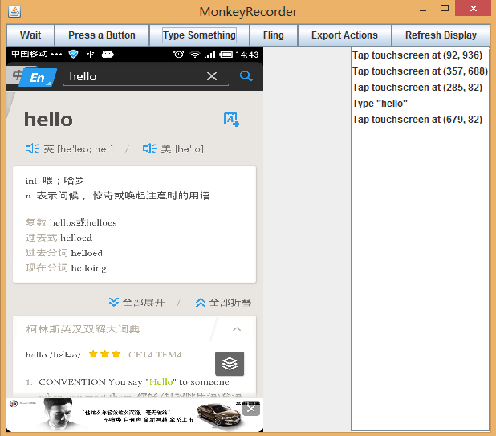

#Android自动化测试之MonkeyRunner#
MonkeyRunner是Google Android SDK下的一个工具，用于自动化测试Android程序。  

Monkeyrunner工具提供了一套API，使用这些api写出的Python程序可以在黑盒地控制Android设置和模拟器。有了Monkeyrunner，我们可以通过python语句控制apk包的安装和卸载、启动app、向app发送各种动作指令、截取图片并保存。 

Monkeyrunner和Monkey不同，Monkey是直接运行在adb shell中的命令，它随机的生成用户或者系统的各种随机事件，而MonkeyRunner则可以通过api来产生特定命令和事件来控制设备和模拟器。  

MonkeyRunner在android测试中有下面特点：  

+ 支持多设备： API可以跨多个设备或模拟器实施测试套件。您可以在同一时间接上所有的设备或一次启动全部模拟器（或统统一起），依据程序依次连接到每一个，然后运行一个或多个测试。您也可以用程序启动一个配置好的模拟器，运行一个或多个测试，然后关闭模拟器。   
+ 功能测试： monkeyrunner可以为一个应用自动贯彻一次功能测试。您提供按键或触摸事件的输入数值，然后观察输出结果的截屏。    
+ 回归测试：monkeyrunner可以运行某个应用，并将其结果截屏与既定已知正确的结果截屏相比较，以此测试应用的稳定性。  
+ 可扩展的自动化：由于monkeyrunner是一个API工具包，您可以基于Python模块和程序开发一整套系统，以此来控制Android设备。除了使用monkeyrunner API之外，您还可以使用标准的Python os和subprocess模块来调用如adb这样的Android工具。     
您还可以向monkeyrunner API中添加您自己的类。我们将在[使用插件扩展monkeyrunner](http://developer.android.com/guide/developing/tools/monkeyrunner_concepts.html#Plugins)一节中对此进行详细讨论。  

monkeyrunner工具使用Jython（使用Java编程语言的一种Python实现）。Jython允许monkeyrunnerAPI与Android框架轻松的进行交互。使用Jython，您可以使用Python语法来获取API中的常量、类以及方法。  

###一个简单的MonkeyRunner的例子###
下面是个monkeyrunner的代码样例，下面代码包含了，连接设备、安装apk包、启动程序、发送键盘指令、截图、保存截图。  

	# python引入monkeyRunner模块
	from com.android.monkeyrunner import MonkeyRunner, MonkeyDevice

	# 连接设备, 获得一个MonkeyDevice对象
	device = MonkeyRunner.waitForConnection()

	# 安装apk包. 返回值是boolean，可以判断是否安装成功
	device.installPackage('myproject/bin/MyApplication.apk')

	# sets a variable with the package's internal name
	package = 'com.example.android.myapplication'

	# sets a variable with the name of an Activity in the package
	activity = 'com.example.android.myapplication.MainActivity'

	# sets the name of the component to start
	runComponent = package + '/' + activity

	# 启动应用程序
	device.startActivity(component=runComponent)

	# 按下手机的菜单键
	device.press('KEYCODE_MENU', MonkeyDevice.DOWN_AND_UP)

	# 截图
	result = device.takeSnapshot()

	# 保存截图
	result.writeToFile('myproject/shot1.png','png')  

###常用API###
	
	#需要引入的模块
	from com.android.monkeyrunner import MonkeyRunner as mr
	from com.android.monkeyrunner import MonkeyDevice as md
	from com.android.monkeyrunner import MonkeyImage as mi

	#等待设备连接，30秒超时，后面是设备名称，该名称可以通过执行命令行`adb devices`获得
	device = mr.waitForConnection(30,'123123135002735')

	#安装apk包
	device.installPackage('d:/有道词典V4.0.3.apk'.decode('utf-8'))
	
	#卸载应用程序
	device.removePackage('com.youdao.dict')

	#启动应用程序
	device.startActivity(component='com.youdao.dict/.activity.DictSplashActivity')

	#等待程序加载,5秒
	mr.sleep(5)

	#拖动操作，四个参数，前两个是初始点、结束点坐标，0.5是持续时间，1是步数
	device.drag((550,500),(100,500), 0.5, 1)
	
	#触摸操作,三个参数，X坐标、Y坐标，触摸类型
	device.touch(80, 1050, "DOWN_AND_UP")

	#截图并保存,注意如果名字中有中文，需要进行utf-8编码，否则乱码
	now = time.strftime("%Y-%m-%d-%H-%M-%S")
    mainPageImage = device.takeSnapshot()
	mainPageImage.writeToFile("d:/"+"主页面截图".decode("utf-8")+now+".png", "png")

	#点击后退键,键盘码详情可以去查sdk帮助文档，路径：android-sdk-windows/docs/reference/android/view/KeyEvent.html
	device.press("KEYCODE_BACK", "DOWN_AND_UP")

	#将日志输出到外部文件,在python中使用中文，需要在文件开头将编码设置为utf-8,否则乱码
	log = open('d:/monkenyLog.txt', 'w')
    log.write("等待手机连接...、\n")
	log.close()

	#截图比较，sameAs()第二个参数表示相似度，0表示完全不相似，1表示完全相同
	imageTrue = mr.loadImageFromFile('d:/shot/true.png')
    if(imageTrue.sameAs(mainPageImage, 0.75)):
        log.write('截图比较成功\n')
    else:
        log.write('截图比较失败\n')
其他详细信息可参加Android sdk文档，路径`android-sdk-windows/docs/tools/help/monkeyrunner_concepts.html`  

###录制脚本###
MonkeyRunner自身提供脚本录制功能，即MonkeyRecorder。  

将下面代码保存成recorder.py  
	from com.android.monkeyrunner import MonkeyRunner as mr
	from com.android.monkeyrunner.recorder import MonkeyRecorder as recorder
	device = mr.waitForConnection()
	recorder.start(device)
  

录制产生的结果，myRecorder.mr:  

	TOUCH|{'x':92,'y':936,'type':'downAndUp',}
	TOUCH|{'x':357,'y':688,'type':'downAndUp',}
	TOUCH|{'x':285,'y':82,'type':'downAndUp',}
	TYPE|{'message':'hello',}
	TOUCH|{'x':679,'y':82,'type':'downAndUp',}

想要录制回放，还要借助`monkey_playback.py`文件，这个文件用来连接手机，初始化一些变量，解析我们的myRecorder.mr。  
使用命令`monkeyrunner monkey_playback.py myRecorder.mr`即可运行。  
###总结###
MonkeyRunner提供的操作有限，适合重复性、短路径的测试，不适合连续性的操作，由于type和drag方法的不稳定，很容易偏离我们的预期。MonkeyRunner操作依赖于控件坐标（也可以通过id，比较耗时），一旦UI发生改变，脚本无法使用。  

Monkeyrunner的等待机制`MonkeyRunner.sleep(5)`,无法更加友好地等待；MonkeyRunner不提供结果断言，我们只能通过截图比较，无法摆脱人工干预。

